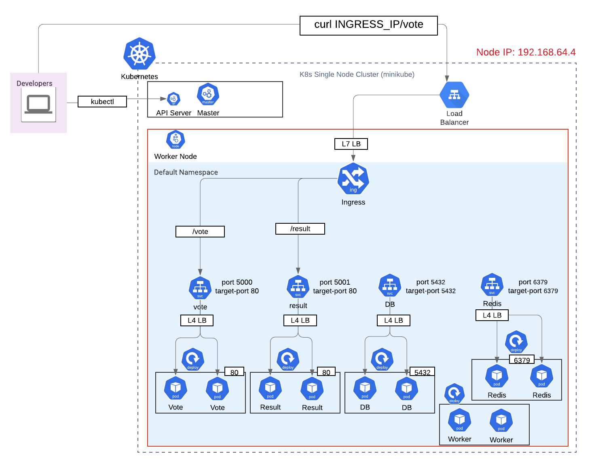

# サンプルアプリ作成までの手順

作成するアプリケーションの構成




## 各サービスの作成

### voteサービス

```bash
# voteのデプロイを作成
kubectl create deployment \
--port 80 vote \
--replicas 2 \
--image dockersamples/examplevotingapp_vote:before \
--dry-run -o yaml > deployment_vote.yaml
# 適用
kubectl apply -f deployment_vote.yaml
# 内外に公開するのでNodePortで作成
kubectl expose deploy vote \--port 5000 --target-port 80 \
--type NodePort --dry-run=client \
-o yaml
```

### resultサービス

```bash
# resultのデプロイを作成
kubectl create deployment \
--image dockersamples/examplevotingapp_result:before \
--port 80 result \
--replicas 2 \
--dry-run -o yaml > deployemen_result.yaml
# 適用
kubectl apply -f deployment_result.yaml
# サービス作成
kubectl expose deploy result \ 
--type NodePort \
--port 5001 \
--target-port 80 \
--dry-run -o yaml
```

### workerデプロイメントを作成

```bash
# デプロイメントを作成
 kubectl create deploy worker \ 
--image dockersamples/examplevotingapp_worker \
--replicas 2 \
--dry-run -o yaml > deployment_worker.yaml
# 環境変数を追記
# 適用
kubectl apply -f deployment_worker.yaml
```

### dbサービスを作成

```bash
# デプロイメントを作成
kubectl create deploy db \
--image postgres:9.4 \
--port 5432 \
--env POSTGRES_USER=postgres \
--env POSTGRES_PASSWORD=postgres \
--replicas 2 \
--dry-run -o yaml > deployment_db.yaml
# 適用
kubectl apply -f deployment_db.yaml
# サービス作成
kubectl expose deploy  db \
--type ClusterIP \
--port 5432 \
--target-port 5432 \
--dry-run -o yaml > service_db.yaml
# 適用
kubectl apply -f service_db.yaml
```

### Redisサービスを作成

```bash
# デプロイを作成
kubectl create deploy redis \
--image redis:alpine \
--replicas 2 \
--port 6379 \
--dry-run -o yaml > deploy_redis.yaml
# 適用
kubectl apply -f deploy_redis.yaml
# サービス作成
kubectl expose deploy redis \
--type ClusterIP \
--port 6379 \
--target-port 6379 \
--dry-run -o yaml > service_redis.yaml
# 適用
kubectl apply -f service_redis.yaml
```

## Ingressを作成

### VoteとResultのサービス前にIngressを配置

```bash
kubectl apply -f ingress.yaml
# ingressのIPを取得
kubectl get service 
# ingressのIPを取得
http://IP/vote
```

