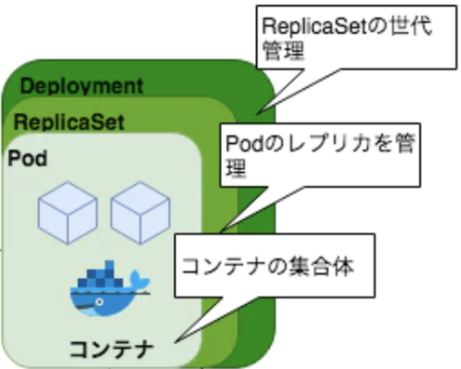
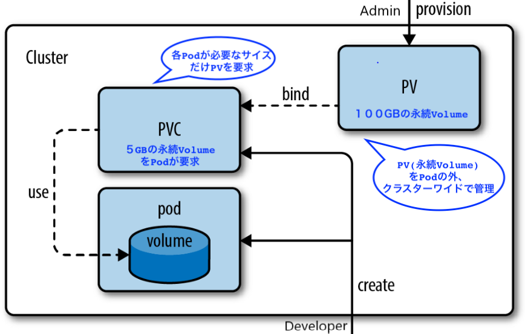

# Kubernetesの学習用

業務でEKSを利用しそうなので、まずはKubertetesの基礎を学習

## 命令的なコマンドでのHelloWorld

kubectlでマニフェストに基づいて、マスターにリソースの操作をさせる

Pod・・・コンテナをグループ化するもの

Podは管理上の基本単位で仮想NICを教諭して、仮想ホストのような働きをするもの

ワーカーNodeの中に作成される

### helloworldPodの作成

```bash
# helloworldのpodを起動
kubectl run --image gcr.io/google-samples/hello-app:1.0 --restart Never helloworld
# Podを表示
kubectl get pods
# Pod内のコンテナのログを表示
kubectl logs helloworld
# Podのメタデータをみる
kubectl describe pod helloworld
# 作業中のコンテナの中でシェルを起動(docker exec)
kubectl exec -it helloworld sh
# Podを削除
kubectl delete pod helloworld
# コンテナの環境変数を設定する
kubectl run --env TEST_ENV=hello_world --image gcr.io/google-samples/hello-app:1.0 --restart Never helloworld
# 環境変数確認
kubectl exec -it helloworld env
```

### Pod間の通信

```bash
# 以下新しくcurlPodをクラスタの中に作成して、Pod間での通信をチェック
# kubectl getコマンドの結果からhelloworldコンテナのIP部分をコピーしてくる
kubectl get pod -o wide | grep helloworld  | awk '{print $6}' | pbcopy
# クラスタの中に新たにcurlのPodを作成してみる
kubectl run --restart Never --image curlimages/curl:7.68.0 -it --rm curl sh 
# curlPodからHelloWorldコンテナにcurlしてみる
curl `helloworldコンテナのIPアドレス`
```

### Serviceとは

- ServiceはPodをクラスターないに後悔する静的IPを持ったL4ロードバランサーのこと
- クラスター内外からPodへの安定的なアクセスを提供できる

#### クラスターIPサービス

- クラスターIP
  - いつ消えるかわからないPodIPを抽象化して、StaticIPを持ったProxyを前に置くことで
    - Podにアクセスする際にPodIPを知る必要がなくなる
    - Podにアクセスする際にロードバランスしてくれる

```bash
# クラスターIPのサービスとしてPodに公開していく
kubectl expose pod helloworld --type ClusterIP --port 8080 --name helloworld-clusterip
# 確認
kubectl get service
# クラスター内の他のPodからhelloworld クラスターIPサービスにアクセステスト
kubectl run --restart Never --image curlimages/curl:7.68.0 -it --rm curl sh
curl helloworld-clusterip:8080
```

#### NodePortIPサービス

NodePort Serviceを使う利点は、ClusterIPでは不可能だったクラスター街外へのPodの後悔をNodeIpとNodePort経由で可能にする

```bash
# まずはクラスタ内のPodから通信を確認
# NodePort作成
kubectl expose pod helloworld --type NodePort --port 8080 --name hellowolrd-nodeport
# 確認
kubectl get service
# クラスタないにcurlPodを作成してシェル接続
kubectl run --restart Never --image curlimages/curl:7.68.0 -it --rm curl sh
# helloworld NodePort serviceへCurlでアクセステスト
curl hellowolrd-nodeport:8080
```

```bash
# 次にクラスタ外からの通信を確認
curl localhost:30590 #フォワードされているポートでも可能
# minikubeなら以下のように
minikube ip
curl ${ip}:31899
```

外部に公開できるのは良いが
- NodeのIPを知っておかないといけない
- クラスター上のNodeも起動・停止してIPが入れ替わるので
- Nodesの前にロードバランサーを配置して、静的なIPとDNSを与えておく必要がある

#### ロードバランサーサービス

- クラウドプロバイダのL4ロードバランサーのDNSから、各ノードの特定のポートにルーティングしてPodにアクセスする
- k8sクラスターをクラウドで運用する場合はLodBalancerのサービスにLBのPIPとDNSが与えられる

問題・デメリット
- １つのサービスごとに1つのLBが作られる
- L4レベルなので、IPまでしかわかっていない
  - HTTPリクエストのパラメーターを見てルーティングとかできない
- L7レベルの振り分けが必要な場合は、この後に記載するIngressを使う

```bash
# ロードバランサーサービスの公開
kubectl expose pod helloworld --type LoadBalancer --port 8080 --name heloworld-lb
# ロードバランサー内からアクセス可能
kubectl run --restart Never --image curlimages/curl:7.68.0 -it --rm curl sh
curl heloworld-lb:8080

# minikubeの場合
# クラウドの場合LBのパブリックIPとDNSが与えられる
curl $(minikube service helloworld-lb --url)

```

#### Ingress

Ingressはクラスター内外に公開するL7ロードバランサー

- L7なのでL4より上のレイヤーの情報を持っている
- HTTPのパスをみて、サービスを振り分けるとかできる
  - URLのホスト
  - パス振り分けとか

```bash
# mininkubeの場合
minikube addons list
minikube addons enable ingress
# kubectlで確認
kubectl get ingress
kubectl describe ingress helloworld
curl $(kubectl get ingress | awk '{print $4}' )

# v2api作成してパスで振り分ける
kubectl run --image gcr.io/google-sample/hello-app:2.0 --port 8080 --restart Never helloworld-v2
kubectl expose pod helloworld-v2 --type NodePort --port 8080 --name helloworld-v2-nodeport
kubectl apply -f ingress path.yaml

# 確かめてみる
kubectl run --restart Never --image curlimages/curl:7.68.0 -it --rm curl sh
curl $(kubectl get ingress helloworld-v2 | awk '{print $4} | tail -1/helloworld_v2')
```
### ReplicaでPodをスケールアップ

Pod数を複製して冗長化してくれる

```bash
kubectl apply -f replicaset.yaml
kubectl get replicaset
# kubectlでレプリカセットの数を増やしてみる
kubectl scale --replicas=5 replicaset/helloworld
# ポッドの数を確認
kubectl get pod | sed -e '1d' | wc -l
> 5
# わざとPodを消してみる
kubectl get pod | awk '{print $1}' | tail -1 | xargs -IPODNAME  kubectl delete pod PODNAME 
# それで調べて見ても勝手にPodを増やしてくれている
kubectl get pod | sed -e '1d' | wc -l
> 5
```

### DeploymentでPodのローリングアップデート・ロールバック

PodのDeploy時に新しいreplicaSetを作成し、古いReplicaSetのPodを段階的に置き換えていく

デプロイメント・レプリカセット・Podの関係性

- Podはコンテナの集合体
- レプリカセットはPodのレプリカを管理
- デプロイメントはレプリカセットの世代管理



```bash
# --restart Always は非推奨なので以下のようにdeploymentを作成
# kubectl run --image gcr.io/google-samples/hello-app:1.0 helloworld
kubectl create deployment --image gcr.io/google-samples/hello-app:1.0 helloworld
# Depliymentの情報をリストアップ
kubectl get deployment
# 3つにスケールアップ
kugectl scale --replicase=5 deploy/helloworld

# Mac(クラスタ外)からDeploymentで配置されたPodにアクセスできる
curl $(minikube service helloworld-nodeport --url)

# デプロイ
kubectl set image deploy/helloworld hellowold=gcr.io/google-samples/hello-app:2.0

# ローリングアップデート中にcurlするとv1とv2の両方からレスポンスが帰る
for i in {1..30}; do curl $(minikube service helloworld-nodeport --url); done

# 履歴確認
kubectl rollout history deploy/helloworld
# ロールバック
kubectl rollout undo deploy/helloworld

```

## yamlファイルで宣言的にリソースを管理

### 概要

Yamlに宣言的に最終の状態を定義しておくことで
- よしなにk8sがその状態を適用してくれる
- yamlをGit管理することができる

実はコマンドからymlを生成することができる

```bash
# pod設定をyamlにアウトプット
kubectl run \
--port 8080 \
--image gcr.io/google-samples/hello-app:1.0 \
--restart Never \
helloworld \
--dry-run \
-o yaml \
helloworld > pod.yaml

# サービスの設定をアウトプット
kubectl expose pod helloworld \
--type ClusterIP \
--port 8080 \
--name helloworld-clusterip \
--dry-run \
-o yaml > service.yaml

# デプロイの設定をアウトプット
kubectl run \
--port 8080 \
--image gcr.io/google-samples/hello-app:1.0 \
--dry-run \
-o yaml \
helloworld > deploy.yaml
```

kubectl run --restart オプション

```
--restart Never -> pod
--restart Always -> Deployment #非推奨
--restart OnFailuer -> Job
```

削除も簡単

```bash
kubectl delete -f pod.yaml
```

## Storage

### ConfigMap

ConfigMapは環境変数などをKey Valueペアとして保存するリソース
yamlに直接環境変数を定義することもできるが、再利用がしにくい
（全てのyamlファイルに記載していく必要がある)

```bash
# configmapの作成
kubectl create configmap my-config \
--from-literal=TEST_ENV=Hello_Wolrd \
--dry-run \
-o yaml > config.yaml
# 適用と確認
kubectl apply -f configmap.yaml
kubectl get configmap
```

上で作ったconfig.ymlをPodのyamlから参照するだけ

```yaml
  - env:
    # 環境変数の名前を定義
    - name: TEST_ENV
      valueFrom:
        configMapKeyRef:
          # ConfigMapの名前を指定
          name: my-config
          # ConfigMapのKeyを指定
          key: TEST_ENV
```

### PodにVolumeをマウント

Podは同じIP・同じファイルシステムを共有。
仮想ホストと考えるとわかりやすい。

ConfigMapは環境変数だけでなく、単純にKeyValueペアを保存してそのデータをファイルとしてマウントすることもできる。

### SecretとしてConfigMapで定義

Base64でエンコードしてKeyValueペアとして保存するリソース。
誰でもDecodeできるから、DB_PAWSSWORDとかをSecreteに保存するべきではない。


※ Databaseファイルなどを保存するのは不向き。そのようなPodが消えても消えないデータを管理するには、永続ボリュームを利用する必要がある

### PersitentVolume(永続ボリューム)

まずクラスタに共通なPV(物理的な永続ボリューム)を定義

そのPVについて、各Podから容量をもらう(PVC)



Pod <=> Node でファイル・ディレクトリを共有できる

## Network

### NameSpaceの管理

```bash
kubectl create namespace staging
kubectl run --image gcr.io/google-samples/hello-app:1.0 \
  --restart Never \
  -- namespace staging \
  helloworld
kubectl get pod --namespace default
kubectl get pod --namespace staging
kubectl delete namaspace staging
```

